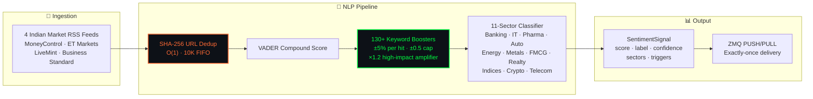

 

 

  

*Sole-authored by **[Ridhaant Ajoy Thackur](https://github.com/Ridhaant)** · Extracted from [AlgoStack](https://github.com/Ridhaant/AlgoStack)*

---

## ⚡ What Is SentiTrade?

A production-tested NLP sentiment pipeline purpose-built for **Indian financial markets** — ingests 4 simultaneous RSS feeds, applies domain-adapted VADER with **130+ NSE/BSE keyword boosters**, classifies across **11 sectors**, and distributes structured signals over ZMQ PUSH/PULL. Optional GenAI enrichment via Anthropic Claude / OpenAI / Gemini (env-only keys — never hardcoded).

---

## 🏗️ Pipeline Architecture

### Why SHA-256 Dedup?

Fixed 16-char hex keys prevent URL-based injection attacks. O(1) lookup with predictable memory (bounded 10K FIFO). Avoids regex-based URL parsing vulnerabilities.

### Why Domain-Adaptive Boosters?

Standard VADER is calibrated for social media — Indian financial news uses domain-specific terminology ("FII buying", "NPA", "Nifty breakout"). 130+ keyword boosters bridge this gap with measurable impact: ±5% compound shift per keyword hit, capped at ±0.5 to prevent keyword stuffing.

---

## 🔗 Proven in Production

Extracted from [AlgoStack](https://github.com/Ridhaant/AlgoStack)'s live NLP layer — processing real Indian market news in real-time across 16 concurrent processes.

---

## 📦 Related

---

© 2026 Ridhaant Ajoy Thackur · MIT License

